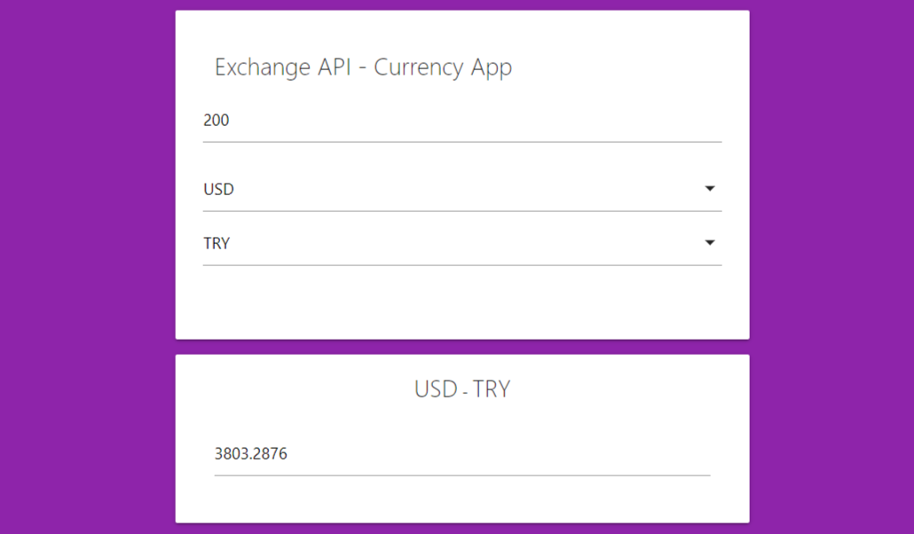

# JavaScript Currency App

Exchange API is a currency converter app that allows users to convert one currency to another using real-time exchange rates. Users can input the amount they wish to convert and select the two currencies they want to convert from and to.

Note: Exchange rates are fetched from the [Exchange Rates API](https://exchangeratesapi.io/).

---

## Getting Started

Clone the repository and open `index.html` in your browser.

    git clone https://github.com/yusufasur/currency-app.git

## Features

-   User-friendly UI
-   Supports conversion between 32 different currencies
-   Uses real-time exchange rates
-   Calculates and displays the converted amount in real-time

## File Structure

    ├── css
    │   └── materialize.min.css
    ├── js
    │   ├── app.js
    │   ├── currency.js
    │   └── ui.js
    ├── index.html
    └── README.md

## How to use the application

-   Enter the amount you want to convert in the "Amount" field.
-   Select the currency you want to convert from in the first drop-down menu.
-   Select the currency you want to convert to in the second drop-down menu.
-   The converted value will be displayed in the "Result" field.

## Files

This project consists of three JavaScript files and an HTML file:

-   `index.html`: This file contains the markup for the application.
-   `ui.js`: This file contains the UI class, which handles user interface interactions.
-   `currency.js`: This file contains the Currency class, which fetches exchange rates from an API.
-   `app.js`: This file contains the main application logic, which initializes the UI and Currency classes and handles user input.

## Built With

-   HTML
-   CSS (Materialize)
-   JavaScript

## Dependencies

-   MaterializeCSS v1.0.0

## License

This project is licensed under the [MIT License](https://opensource.org/license/mit/)
